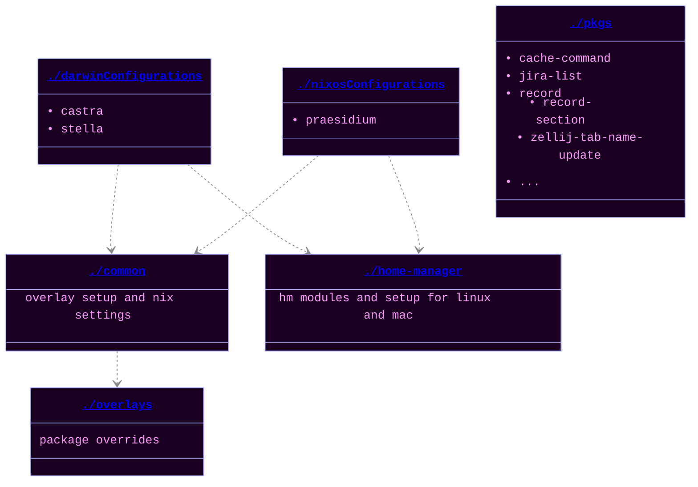

# dots ◌ ⋅ ⋯ ⦿ .̇ ⨀ ⊚ ⋮ ⧂ ○ ∘ ⦾ : … ◎ 

I love Nix! It has helped me further my development more than any
other tool I have used. I hope that my config is helpful for you. If you
have questions, please create an issue or privately message me by
emailing github@xav.ie <3.

You might also enjoy my [Neovim Config](https://github.com/xav-ie/xnixvim).

    <em>Project Layout</em>

## Usage

I don't think you should try and directly use my dotfiles; it probably
would not work. You should intead check out my [packages](./pkgs) and
other bits of config.

## Things I am working on

Secrets
  
I want to configure secrets the "right way".

- [ ] Use `pass` or `age` to just store all my ENV variables, but
      then it is another master password to remember, so I think I would
      rather figure something out with the bitwarden cli, my manager of
      choice. Honestly, I don't really know the best course of action,
      because what if I want to change my manager?? I might also want to
      just completely forgo bitwarden and just use good old encryption...
      There has to be someone else who thought of this
- [ ] Look into these secret solutions others have worked on:

  - [Secrets Management with SOPS-NIX by Vimjoyer](https://youtube.com/watch?v=G5f6GC7SnhU)
  - [NixOS Secrets Management by Emergent Mind](https://youtube.com/watch?v=G5f6GC7SnhU)
  - [Encrypted Secrets with NixOS](https://xeiaso.net/blog/nixos-encrypted-secrets-2021-01-20/)
  - [A Modern and Secure Desktop Setup](https://discourse.nixos.org/t/a-modern-and-secure-desktop-setup/41154)
  - [We should manage secrets the systemd way!](https://youtube.com/watch?v=YFXwV0ZO9NE)
  - [Alternative way to handle secrets](https://discourse.nixos.org/t/alternative-way-to-handle-secrets/35511)
  - [Introducing Secrix](https://journal.platonic.systems/introducing-secrix)
  - [Handling Secrets in NixOS: An Overview](https://discourse.nixos.org/t/handling-secrets-in-nixos-an-overview-git-crypt-agenix-sops-and-when-to-use-them/35462)
  

IOT
  
I have some things in my house that I want control with my computer.

- Computer lights are semi-controllable through `open-rgb -p`, but I
  need to set up more profiles.
- Govee light is controlled via an API. I think I just have to build a
  simple script to do so.
- Apple Home / TP-Link Switches.. I have no idea how to connect to
these yet, but I do know it is annoying to open my phone to turn on
my lights... I probably need to buy a homepod mini to also make them
"always connected" bc my phone takes like 10-20 seconds to connect
to them when I get home, which is really annoying bc it also
sometimes does not connect.

Waybar replacement
  
I am not 100% happy with Waybar. It is a great tool for getting started,
but I want complete control. Also, the blur is controled through hacks.
Vimjoyer made a video on AGS: https://youtube.com/watch?v=GvpTUKaXqNk

I think this is a good idea to learn because it seems extremely
extensible to make future applications.

This should also mean I get keyboad access!

Firefox Sync

- [ ] I need to just make my firefox configured more through Nix. A
      lot of my plugins and settings are not 100% synced properly.
- [ ] I also need to find a RSS reader that can read/sync with a file
    system. I am currently using FeedBro, but it does not sync between
    my desktop and laptop.

Automated Testing

You will notice that a lot of my commits are update, then fixing the
update. This is because I update depencies from my desktop or laptop,
and then update from the other. This often leads to build time errors
that only occurs on the other system due to new options/drivers/etc.

There is a person who has a twitter thread (I can't remember who >:[)
who explain how they set up automated Github CI to test their config.

This would be **amazing** and I want to set this up, too.

I also want it to be where it will also boot up the desktop and take a
screenshot of it open and maybe even do some actions.

Miscellaneous

- [ ] Global mute - this will require building a virtual HID device
      that is recognized by Zoom. Then, when you mute this virtual device,
      the state is reflected in Zoom as well. This opens up many
      possibilities, the most obvious being a notification tray icon you
      can use to easily see muted state
- [ ] Backgrounds repo/drive sync: I need to sync my backgrounds with
      proton drive.
- [ ] Email notifications - web browser email notifications are
      acceptable, but they do not have a "delete" nor a "mark as read
      action", which would really help me to get to inbox 0.
- [ ] PETS - I really want to modify Spamton-Linux-Shimejii repo to
      have multiple different types of Shimejii. Right now, there is just
      this really ugly one. I also want to fix the divide by zero errors
      that keep making it crash.
- [ ] Email - just set up himalaya email client in vim.
- [ ] Reminders - I want my gcal to appear in my system and I want to
      be able to easily manage past and future reminders, a calendar. So I
      just have to set up a good and pretty system calendar
- [ ] Pomodoro - Set up system pomodoro
- [ ] Screensharing - I would prefer somebindings and a bit more
      chrome/indicators in my bar to show that I am sharing screen. I
      dislike that I could be screensharing and not really be aware that I
      am.
- [ ] Do Not Disturb - I would like to trigger DND when I am
      scrensharing. I really dislike that notifications come through on
      screenshare. Maybe I can still allow notifications, but hide them
      from screenshare entirely??? That would be really cool.
- [ ] use nix-colors repo for theming everything This is interesting: 
      [colemickens/nixcfg/mixins/_preferences.nix](https://github.com/colemickens/nixcfg/blob/3705032fd67f231fe83fd3bc25d4021b80394b1c/mixins/_preferences.nix)

## Other Nix Configs

I used these configs to help build mine:

- [Misterio77/nix-config](https://github.com/Misterio77/nix-config/blob/e360a9ecf6de7158bea813fc075f3f6228fc8fc0)
- [clemak27/linux_setup](https://github.com/clemak27/linux_setup/blob/4970745992be98b0d00fdae336b4b9ee63f3c1af)
- [CosmicHalo/AndromedaNixos](https://github.com/CosmicHalo/AndromedaNixos/blob/665668415fa72e850d322adbdacb81c1251301c0)

I definitely used a lot more, utilising mostly github search.
