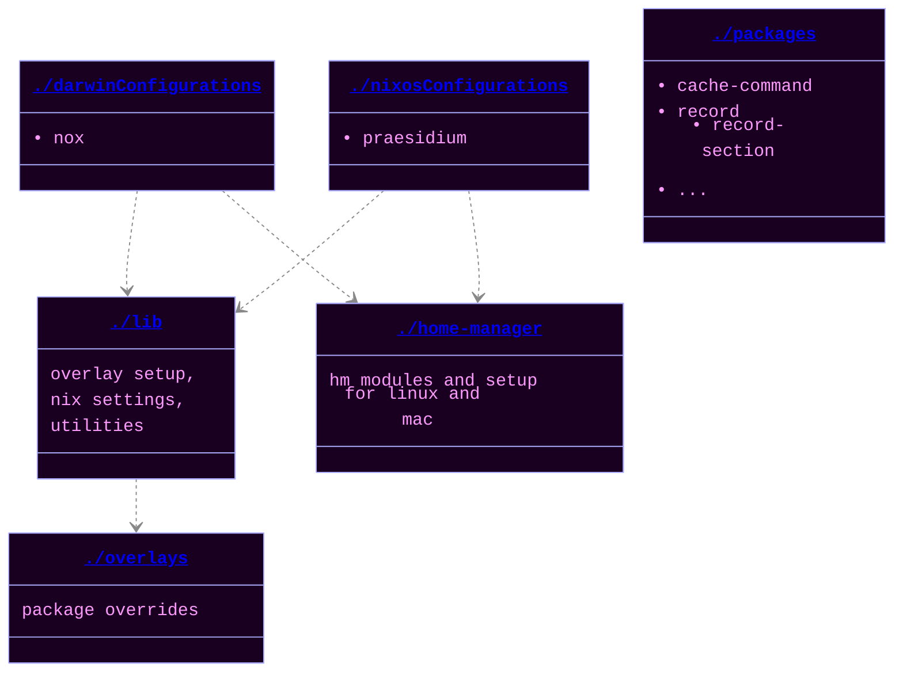

# dots ◌ ⋅ ⋯ ⦿ .̇ ⨀ ⊚ ⋮ ○ ∘ ⦾ : … ◎ 

I love Nix! It has helped me further my development more than any
other tool I have used. I hope that my config is helpful for you. If you
have questions, please create an issue or privately message me by
emailing github@xav.ie <3.

You might also enjoy my [Neovim Config](https://github.com/xav-ie/xnixvim).

```mermaid
---
config:
  theme: base
  themeVariables:
    primaryColor: "#1a0020"
    primaryTextColor: "#fa99fa"
    primaryBorderColor: "#aaaafa"
    lineColor: "#888"
    fontFamily: "monospace"
---
classDiagram
    %% Unfortunately, we cannot use relative links and must specify a branch :/
    class lib["<a href='https://github.com/xav-ie/dots/tree/main/lib'>./lib</a>"]
    class darwinConfigurations["<a href='https://github.com/xav-ie/dots/tree/main/darwinConfigurations'>./darwinConfigurations</a>"]
    class home-manager["<a href='https://github.com/xav-ie/dots/tree/main/home-manager'>./home-manager</a>"]
    class nixosConfigurations["<a href='https://github.com/xav-ie/dots/tree/main/nixosConfigurations'>./nixosConfigurations</a>"]
    class overlays["<a href='https://github.com/xav-ie/dots/tree/main/overlays'>./overlays</a>"]
    class packages["<a href='https://github.com/xav-ie/dots/tree/main/packages'>./packages</a>"]

    lib: overlay setup,
    lib:  nix settings,
    lib:  utilities
    darwinConfigurations: • nox
    home-manager: hm modules and setup
    home-manager: for linux and mac
    nixosConfigurations: • praesidium
    overlays: package overrides
    packages: • cache-command
    packages: • record
    packages: • record-section
    packages: • ...

    lib ..> overlays
    darwinConfigurations ..> lib
    darwinConfigurations ..> home-manager
    nixosConfigurations ..> lib
    nixosConfigurations ..> home-manager
```

    <em>Project Layout</em>

## Usage

I don't think you should try and directly use my dotfiles; it probably
would not work. You should instead check out my [packages](./packages) and
other bits of config.

## Things I am working on

Stuff

- [ ] Automated Testing
      You will notice that a lot of my commits are update, then fixing the
      update. This is because I update dependencies from my desktop or laptop,
      and then update from the other. This often leads to build time errors
      that only occurs on the other system due to new options/drivers/etc.
      There is a person who has a twitter thread (I can't remember who >:[)
      who explain how they set up automated GitHub CI to test their config.
      This would be **amazing** and I want to set this up, too.
      I also want it to be where it will also boot up the desktop and take a
      screenshot of it open and maybe even do some actions.
- [ ] I have some things in my house that I want control with my computer.
      Computer lights are semi-controllable through `open-rgb -p`, but I
      need to set up more profiles.
- [x] Global mute - this will require building a virtual HID device
      that is recognized by Zoom. Then, when you mute this virtual device,
      the state is reflected in Zoom as well. This opens up many
      possibilities, the most obvious being a notification tray icon you
      can use to easily see muted state
- [ ] Backgrounds repo/drive sync: I need to sync my backgrounds with
      proton drive.
- [ ] Email notifications - web browser email notifications are
      acceptable, but they do not have a "delete" nor a "mark as read
      action", which would really help me to get to inbox 0.
- [ ] PETS - I really want to modify Spamton-Linux-Shimejii repo to
      have multiple different types of Shimejii. Right now, there is just
      this really ugly one. I also want to fix the divide by zero errors
      that keep making it crash.
- [ ] Email - just set up Himalaya email client in vim.
- [x] Reminders - I want my GCal to appear in my system and I want to
      be able to easily manage past and future reminders, a calendar. So I
      just have to set up a good and pretty system calendar
- [ ] Pomodoro - Set up system pomodoro
- [x] Screen sharing - I would prefer some bindings and a bit more
      chrome/indicators in my bar to show that I am sharing screen. I
      dislike that I could be screen sharing and not really be aware that I
      am.
- [x] Do Not Disturb - I would like to trigger DND when I am
      screen sharing. I really dislike that notifications come through on
      screen share. Maybe I can still allow notifications, but hide them
      from screen share entirely??? That would be really cool.
- [ ] Use nix-colors repo for coloring everything This is interesting:
      [colemickens/nixcfg/mixins/\_preferences.nix](https://github.com/colemickens/nixcfg/blob/3705032fd67f231fe83fd3bc25d4021b80394b1c/mixins/_preferences.nix)
- [ ] Try out and get good at Jujutsu
  - [ ] [What if version control was AWESOME?](https://www.youtube.com/watch?v=2otjrTzRfVk)
  - [ ] [jj-init](https://v5.chriskrycho.com/essays/jj-init/)
  - [ ] [Steve's Jujutsu Tutorial](https://steveklabnik.github.io/jujutsu-tutorial)
  - [ ] [Jujutsu Tutorial](https://jj-vcs.github.io/jj/latest/tutorial/)
  

## Other Nix Configs

I used these configs to help build mine:

- [Misterio77/nix-config](https://github.com/Misterio77/nix-config/blob/e360a9ecf6de7158bea813fc075f3f6228fc8fc0)
- [clemak27/linux_setup](https://github.com/clemak27/linux_setup/blob/4970745992be98b0d00fdae336b4b9ee63f3c1af)
- [CosmicHalo/AndromedaNixos](https://github.com/CosmicHalo/AndromedaNixos/blob/665668415fa72e850d322adbdacb81c1251301c0)

I definitely used a lot more, utilizing mostly GitHub search.
