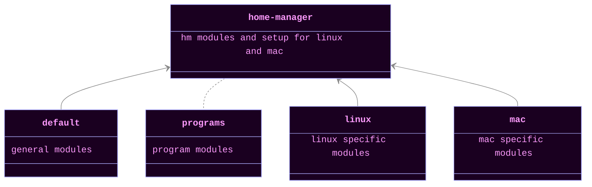

# home-manager

Home Manager is an amazing tool for configuring your systems. Generally,
these configurations are portable and easy-to-use. They come with
convenient nixified knobs to configure programs you want installed and
it is simple to escape into raw config when necessary.

You can find out more about Home Manager on [their homepage](https://nix-community.github.io/home-manager/).

Instead of reading through the giant manual, I highly recommend [Home Manager
Option Search](https://home-manager-options.extranix.com/) when you are trying to find options.

    <em>My Home Manager Layout</em>

[..](..)
